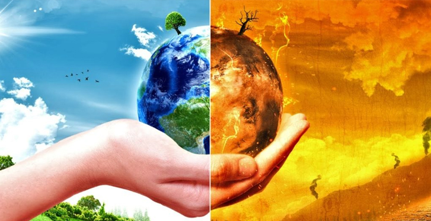
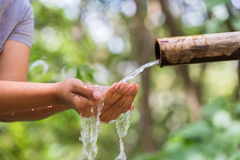
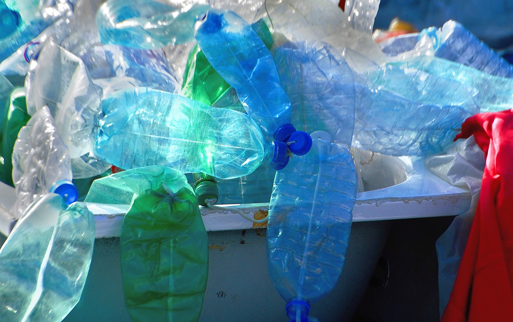
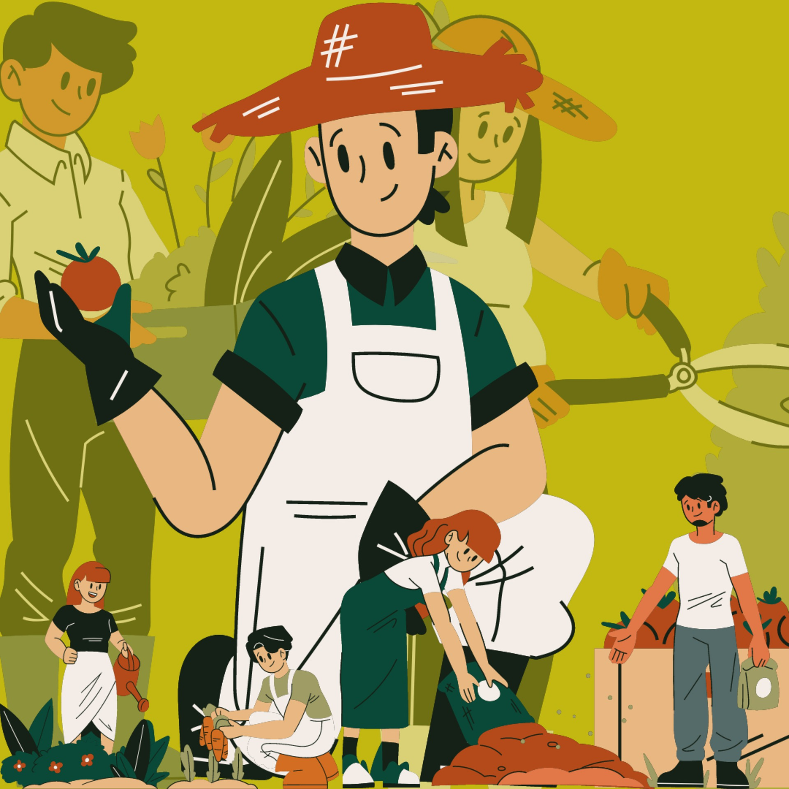
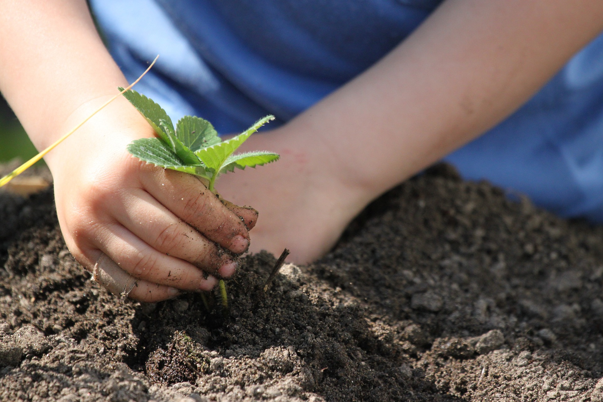
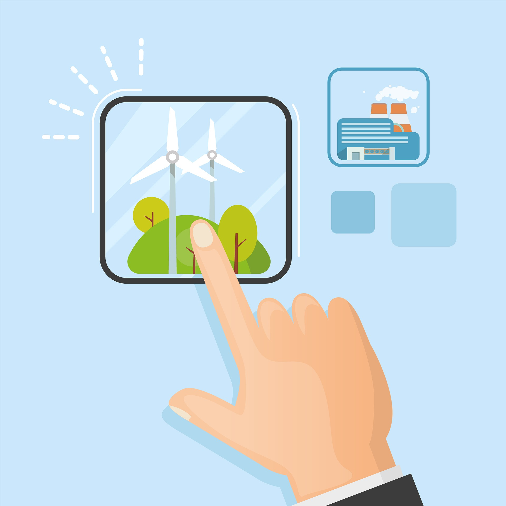

# Social Media Post - Formato "Carrusel"

## Exploración previa

### Puntos Clave a contemplar para el contenido:
- Acciones de nuestra vida diaria.
- Algo que no tome mucho esfuerzo.
- Cambios que puedan impactar positivamente al cambio climático.
- Concientizar sobre nuestras acciones.

Referencias:
> https://www.instagram.com/zerowastehome/

> https://twitter.com/ClimateReality

> https://www.pinterest.com/search/pins/?q=sustainable%20living

## Versión Preliminar
```
¡Tu Guía Personal para Combatir el Cambio Climático desde México!

¿Te preocupa el cambio climático pero no sabes por dónde empezar? ¡No te preocupes, estás en el lugar correcto!  Sabemos que puede parecer un problema gigante, pero cada pequeña acción cuenta. Aquí te presentamos una guía amigable con acciones concretas que puedes tomar desde tu hogar, tu comunidad y tu día a día para hacer la diferencia.

En Casa:

¡Apaga la luz!: Aprovecha la luz natural siempre que puedas y apaga las luces al salir de una habitación. Cambia tus focos tradicionales por focos LED, que consumen menos energía.
Electrodomésticos inteligentes: Desconecta los aparatos electrónicos cuando no los estés usando. Lava la ropa con agua fría y tiende tu ropa al sol en lugar de usar la secadora.
¡Menos carne, más plantas!: La producción de carne genera una gran cantidad de gases de efecto invernadero. Intenta reducir tu consumo de carne y explora deliciosas recetas vegetarianas.
Reduce, reutiliza, recicla: Separa tus residuos y asegúrate de reciclar todo lo que puedas. Reutiliza envases y bolsas, y evita comprar productos con exceso de empaque.
¡Ahorra agua!: Cierra la llave mientras te cepillas los dientes, repara fugas y recolecta agua de lluvia para regar tus plantas.
En tu Comunidad:

¡Muévete en bici o transporte público!: Deja el coche en casa siempre que puedas y opta por alternativas más sostenibles como la bicicleta, el transporte público o caminar.
Apoya a los productores locales: Compra tus alimentos en mercados locales y consume productos de temporada. Así reduces la huella de carbono de tus alimentos y apoyas la economía local.
Planta un árbol: Los árboles son nuestros aliados en la lucha contra el cambio climático. Planta un árbol en tu jardín, en tu comunidad o participa en campañas de reforestación.
¡Únete a la causa!: Infórmate sobre organizaciones y grupos que trabajan en temas de cambio climático en tu comunidad y participa en sus actividades.
Haz oír tu voz: Habla con tus amigos, familiares y vecinos sobre el cambio climático y la importancia de tomar acción. ¡Juntos podemos generar un cambio!
En tu Día a Día:

¡Lleva tu propia bolsa!: Dile adiós a las bolsas de plástico y lleva tus propias bolsas reutilizables al supermercado y a las tiendas.
Elige productos sostenibles: Opta por productos con empaques ecológicos y busca empresas comprometidas con el medio ambiente.
¡Dile no al desperdicio!: Planifica tus comidas, compra solo lo que necesites y aprovecha las sobras para crear nuevos platillos.
¡Infórmate y educa!: Lee sobre el cambio climático, sus causas y consecuencias. Comparte lo que aprendes con los demás y fomenta la conciencia ambiental.
¡Sé un ejemplo a seguir!: Tus acciones pueden inspirar a otros a tomar acción. Demuestra que es posible vivir de manera más sostenible y motiva a quienes te rodean a hacer lo mismo.
¡Recuerda!

No subestimes el poder de tus acciones.  Cada pequeña decisión cuenta y, juntos, podemos construir un futuro más sostenible para México y el planeta.  ¡Únete al movimiento y sé parte de la solución!
```


### Prompt utilizado
```
Ayudame a generar un artículo en formato de carrusel de instagram con un tono amigable y en forma de guía en el que podamos poner acciones que puede tomar la persona mexicana promedio para ayudar a tomar acción contra el cambio climático. Por favor utiliza emojis para que se vea de manera más ad hoc a Instagram.
```

### Resultado (Dar click en cada título)
<details>
  <summary>¡Tu Guía Personal para Combatir el Cambio Climático desde Casa!</summary>
  
  <p>¿Te preocupa el futuro de nuestro planeta pero no sabes por dónde empezar? ¡No te preocupes, estás en el lugar correcto! Sabemos que el cambio climático puede parecer un problema gigante, pero cada pequeña acción cuenta. Aquí te presentamos una guía práctica y amigable con acciones que puedes tomar desde tu hogar para marcar la diferencia:</p>
<details>
  <summary> ¡Apaga la luz! 💡</summary>
  
<ul>
    <li>Aprovecha al máximo la luz natural: Abre las cortinas y deja que el sol ilumine tu hogar durante el día.</li>
    <li>Cambia a focos LED: Son más eficientes y duraderos, lo que te ayudará a ahorrar energía y dinero.</li>
    <li>Desconecta aparatos que no estés usando: ¿Sabías que muchos aparatos siguen consumiendo energía aunque estén apagados? Desenchufa cargadores, televisores y otros dispositivos cuando no los necesites.</li>
</ul>
</details>
<details>
  <summary> ¡Cuida el agua! 💧</summary>
  
<ul>
    <li>Cierra la llave mientras te cepillas los dientes o te enjabonas las manos.</li>
    <li>Repara fugas y goteras: Una pequeña fuga puede desperdiciar miles de litros de agua al año.</li>
    <li>Recolecta agua de lluvia: Puedes usarla para regar plantas o limpiar pisos.</li>
    <li>¡Duchas cortas y eficientes!: Reduce el tiempo de tus duchas y considera instalar un cabezal de ducha ahorrador.</li>
</ul>
</details>
<details>
  <summary>¡Dile adiós al plástico! 🚫</summary>
  
<ul>
    <li>Lleva tus propias bolsas reutilizables al supermercado.</li>
    <li>Evita comprar productos con empaques excesivos.</li>
    <li>Reutiliza envases y botellas de vidrio.</li>
    <li>¡Dile sí a los termos y botellas reutilizables!: Lleva tu propia agua y café en lugar de comprar bebidas en botellas de plástico.</li>
</ul>
</details>
<details>
  <summary>¡Come rico y sostenible! 🥕</summary>
  
<ul>
    <li>Consume productos locales y de temporada: Apoya a los agricultores locales y reduce la huella de carbono de tus alimentos.</li>
    <li>Reduce el consumo de carne: La producción de carne genera una gran cantidad de gases de efecto invernadero.</li>
    <li>¡Haz composta!: Convierte tus residuos orgánicos en abono para tus plantas.</li>
</ul>
</details>
<details>
  <summary>¡Muévete verde! 🚲</summary>
  
<ul>
    <li>Camina, usa la bicicleta o el transporte público siempre que sea posible.</li>
    <li>Comparte el auto con amigos o familiares.</li>
    <li>Si necesitas comprar un auto, considera uno eléctrico o híbrido.</li>
</ul>
</details>
<details>
  <summary>¡Planta un árbol! 🌳</summary>
  
<ul>
    <li>Los árboles absorben dióxido de carbono y liberan oxígeno, ayudando a limpiar el aire que respiramos.</li>
    <li>Si no tienes espacio para plantar un árbol, puedes apoyar a organizaciones que se dedican a la reforestación.</li>
</ul>
</details>
<details>
  <summary>¡Infórmate y comparte! 🗣️</summary>
  
<ul>
    <li>Mantente informado sobre el cambio climático y las acciones que puedes tomar.</li>
    <li>Comparte tus conocimientos con amigos y familiares.</li>
    <li>¡Únete a movimientos y organizaciones que luchan contra el cambio climático!</li>
</ul>
</details>
</details>

